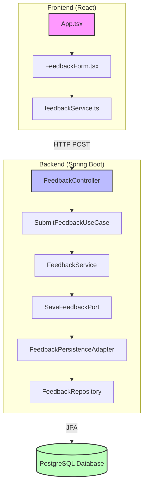

## Component Description

### Frontend (React)
- **App.tsx**: The main React component that renders the application.
- **FeedbackForm.tsx**: The component that handles the feedback form UI and user interactions.
- **feedbackService.ts**: A service that makes HTTP requests to the backend API.

### Backend (Spring Boot)
- **FeedbackController**: The REST controller that handles incoming HTTP requests.
- **SubmitFeedbackUseCase**: An interface defining the use case for submitting feedback.
- **FeedbackService**: The service implementation that processes the feedback submission.
- **SaveFeedbackPort**: An interface defining the port for saving feedback (part of the hexagonal architecture).
- **FeedbackPersistenceAdapter**: The adapter that implements the SaveFeedbackPort interface.
- **FeedbackRepository**: The JPA repository for database operations.

### Database
- **PostgreSQL Database**: The relational database used to store feedback data.

## Data Flow
1. The user interacts with the FeedbackForm component in the frontend.
2. The form data is sent to the backend via an HTTP POST request using the feedbackService.
3. The FeedbackController receives the request and passes it to the SubmitFeedbackUseCase.
4. The FeedbackService processes the feedback and uses the SaveFeedbackPort to persist the data.
5. The FeedbackPersistenceAdapter implements the SaveFeedbackPort and uses the FeedbackRepository to interact with the database.
6. The feedback data is stored in the PostgreSQL database.

This architecture follows a clean, hexagonal structure, separating concerns and making the system modular and easy to maintain.